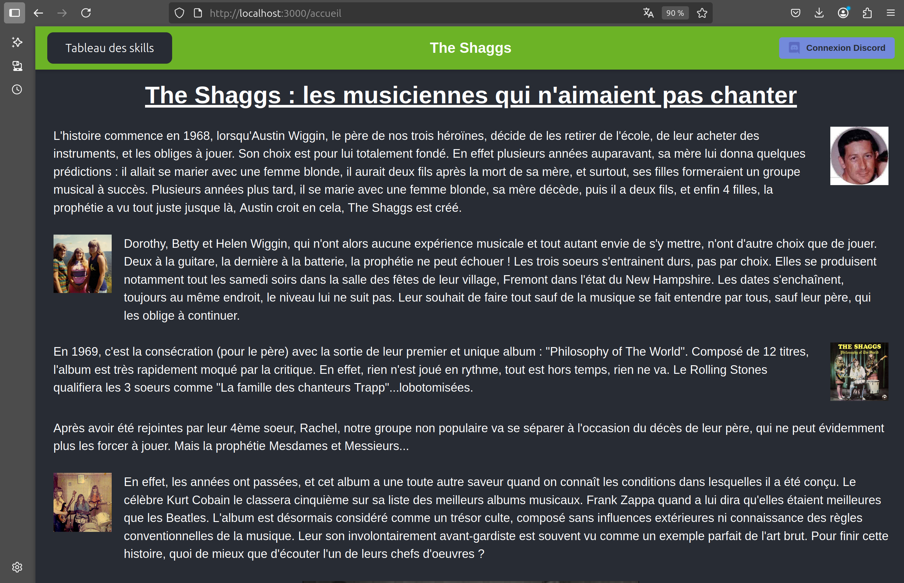
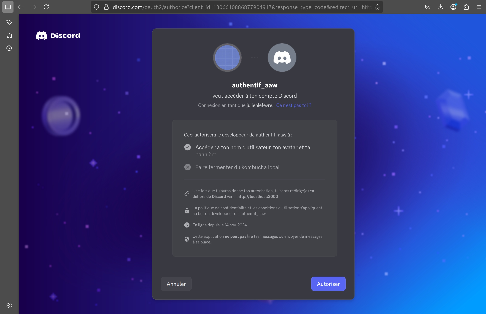
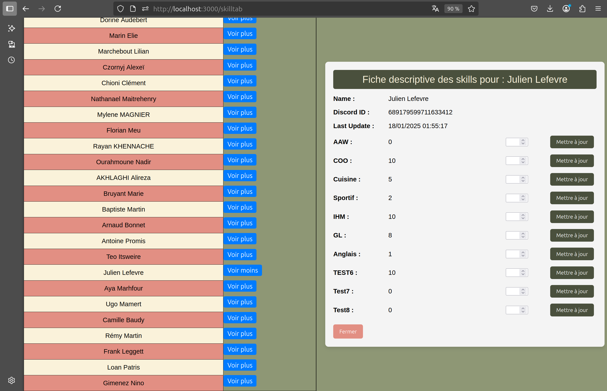

Ce projet de site web à été réalisé en 3ème année de licence Informatique en React et Node.js et mené par : 
	- Téo Itsweire-Krebs
	- Julien Lefevre

## 🏠 Page d’accueil

Nous arrivons tout d'abord sur une **page d'accueil** présentant l’histoire de The Shaggs.

En haut de cette page, on retrouve :
- Un **lien vers le tableau des skills**
- Un **bouton de connexion via Discord**

---

## 🔐 Connexion via Discord

Lorsque l'on clique sur **"Connexion avec Discord"**, tout se fait automatiquement.  
L’utilisateur doit simplement **valider une autorisation finale** :

---

## 📊 Tableau des skills

Une fois connecté, on peut accéder au **tableau des compétences**.

La page affiche :
- Les compétences de tous les membres
- **Uniquement les vôtres sont modifiables**

---

## ✏️ Modification des compétences

Vous pouvez modifier les valeurs de vos compétences.  
Voici un exemple **avant modification** :

---

## ✅ Après validation

Une fois les changements validés, les nouvelles compétences sont enregistrées et affichées immédiatement :

---

## 🛠️ Tech Stack

- Frontend : React
- Backend : Node.js (Express)
- Authentification : OAuth2 via Discord
- Base de données : PostgreSQL (Clever Cloud)

---
